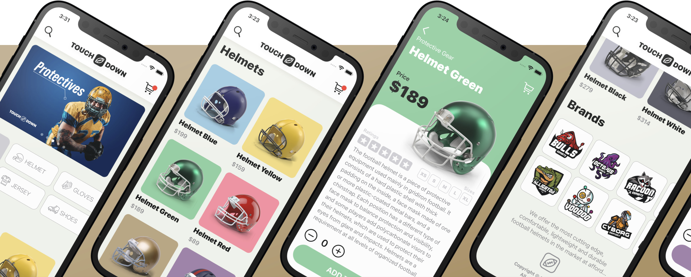

# ECommerce UI

- The main goal of this project to is to create a simple UI for E-commerce App

- How the @Environment property wrapper works,

- How to use the @ObservableObject property wrapper,

- How to share the data model across the whole application with ease,

- How to store all constants in a separate Swift file,

- How to create a custom shape with Shape Path,

- How to use the horizontal grid layout in SwiftUI,

- How to develop a custom navigation bar

 

